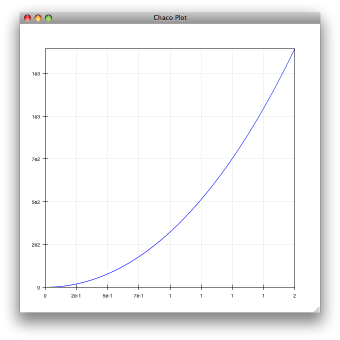

.. _codetools-tutorial-blocks:

Blocks
======

Creating a :class:`Block` object is as simple as invoking it on a string
containing some Python code::

    >>> from enthought.blocks.api import Block
    >>>
    >>> b = Block("""# my calculations
    ... velocity = distance/time
    ... momentum = mass*velocity
    ... """)

The code in the Block can be executed by using its :meth:`execute` method in
much the same way that the :func:`exec` statement works::

    >>> global_namespace = {}
    >>> local_namespace = {'distance': 10.0, 'time': 2.5, 'mass': 3.0}
    >>> b.execute(local_namespace, global_namespace)

After this code, the variables *local_namespace* and
*global_namespace* hold the same contents as if the Block's code had
been executed by the :func:`exec` statement.  In particular::

    >>> local_namespace
    {'distance': 10.0, 'mass': 3.0, 'time': 2.5, 'velocity': 4.0, 'momentum': 12.0}

Whenever you create a Block, it performs an analysis of the code, so the block
can tell you which variables are its inputs and outputs::

    >>> b.inputs
    set(['distance', 'mass', 'time'])
    >>> b.outputs
    set(['velocity', 'momentum'])

In more complex situations, the Block object can give further useful
information about the code, such as imported names and variables which may
conditionally be output.

Restricting Execution
---------------------

Where the Block object is unique is that it is aware of which variables are
dependent on which other variables within its code.  This allows you to
restrict the code that is executed by specifying which input and output
variables you are concerned with.  This is achieved through the
:meth:`restrict` method of the Block object, which expects one or both of
the following arguments:

*inputs*
    a list or tuple of input variables
*outputs*
    a list or tuple of output variables

For example::

    >>> restricted_block = b.restrict(inputs=('mass',))

This restricted block consists of every line that depends on the variable
*mass* in the original code block.  In this case, this is the single line::

    momentum = mass*velocity

Internally, the Block object maintains a representation of the code block as
an abstract syntax tree from the Python standard library `compiler
package <http://docs.python.org/lib/compiler.html>`_.  This representation
is not particularly human-friendly, but the :func:`unparse` function allows us to 
reconstruct the Python source::

    >>> restricted_block.ast
    Assign([AssName('momentum', 'OP_ASSIGN')], Mul((Name('mass'), Name('velocity'))))
    >>> from enthought.blocks.api import unparse
    >>> unparse(restricted_block.ast)
    'momentum = mass*velocity'

This allows us to perform the minimum amount of recalculation in response to
changes in the inputs.  For example, if we change *mass* in the local
name space, then we only need to execute the restricted block which depends
upon *mass* as input::

    >>> local_namespace['mass'] = 4.0
    >>> restricted_block.execute(local_namespace, global_namespace)
    >>> local_namespace
    {'distance': 10.0, 'mass': 3.0, 'time': 2.5, 'velocity': 4.0, 'momentum': 16.0}

On the other hand, if we are interested in calculating only a particular
output, we can restrict on the outputs:

    >>> velocity_comp = b.restrict(outpts=('velocity',))
    >>> unparse(velocity_comp.ast)
    'velocity = distance/time\n'
    >>> velocity_comp.inputs
    set(['distance', 'time'])

.. note::
    Block restriction is designed to answer the questions "What do I need to 
    compute when this changes?" or "What do I need to compute to calculate this
    output?"  It doesn't (yet) answer the question "If I have these inputs, what
    outputs can I calculate?"

.. _rocket-restriction-example:

Example: Rocket Science
-----------------------

At this point, an extended example is probably worthwhile.  Consider the
following code which calculates quantities involved in the motion of a rocket
as it loses reaction mass::

    from helper import simple_integral
    
    thrust = fuel_density*fuel_burn_rate*exhaust_velocity + nozzle_pressure*nozzle_area
    
    mass = mass_rocket + fuel_density*(fuel_volume - simple_integral(fuel_burn_rate,t))
    
    acceleration = thrust/mass
    
    velocity = simple_integral(acceleration, t)
    
    momentum = mass*velocity
    
    displacement = simple_integral(velocity, t)
    
    kinetic_energy = 0.5*mass*velocity**2
    
    work = simple_integral(thrust, displacement)

The :func:`simple_integral` function in the helper module looks something like
this::

    from numpy import array, ones
    
    def simple_integral(y, x):
        """Return an array of trapezoid sums of y"""
        dx = x[1:] - x[:-1]
        if array(y).shape == ():
            y_avg = y*ones(len(dx))
        else:
            y_avg = (y[1:]+y[:-1])/2.0
        integral = [0]
        for i in xrange(len(dx)):
          integral.append(integral[-1] + y_avg[i]*dx[i])
        return array(integral)

Inputs to these computations are expected to be either scalars or 1-D Numpy
arrays that hold the values of quantities as they vary over time. Some of
these computations, particularly the :func:`simple_integral` computations, are
potentially expensive.  We can set up a Block to hold this computation::

    >>> rocket_science = """
    ...    ...
    ... """
    >>> rocket_block = Block(rocket_science)
    >>> rocket_block.inputs
    set(['fuel_volume', 'nozzle_area', 'fuel_density', 'nozzle_pressure', 'mass_rocket',
    'exhaust_velocity', 'fuel_burn_rate', 't'])
    >>> 
    >>> rocket_block.outputs
    set(['acceleration', 'work', 'mass', 'displacement', 'thrust', 'velocity',
    'kinetic_energy', 'momentum'])

We can use this code by setting up a dictionary of local values for the
inputs and then inspecting it::

    >>> from numpy import linspace
    >>> local_namespace = dict(
    ...     mass_rocket = 100.0,         # kg
    ...     fuel_density = 1000.0,       # kg/m**3
    ...     fuel_volume = 0.060,         # m**3
    ...     fuel_burn_rate = 0.030,      # m**3/s
    ...     exhaust_velocity = 3100.0,   # m/s
    ...     nozzle_pressure = 5000.0,    # Pa
    ...     nozzle_area = 0.7,           # m**2
    ...     t = linspace(0.0, 2.0, 2000) # calculate every millisecond
    ... )
    >>> rocket_block.execute(local_namespace)
    >>> print local_namespace["velocity"][::100]  # values every 0.1 seconds
    [    0.            60.91584683   123.00759628   186.32154205   250.90676661
       316.81536979   384.10272129   452.82774018   523.05320489   594.84609779
       668.27798918   743.42546606   820.37061225   899.2015473    980.01303322
      1062.90715923  1147.9941173   1235.39308291  1325.23321898  1417.65482395]
    >>> 
    >>> from chaco.shell import *
    >>> plot(local_namespace['t'], local_namespace["displacement"], "b-")
    >>> show()

Restricting on Inputs
~~~~~~~~~~~~~~~~~~~~~

If we want to change the inputs into this calculation, say to increase the
nozzle area of the rocket to 0.8 m**2 and decrease the nozzle pressure to 4800
Pa, then we don't want to have to recalculate everything. We want to calculate
only the quantities which depend upon *nozzle_pressure* and *nozzle_area*.
We can do this as follows::

    >>> restricted_block = rocket_block.restrict(inputs=("nozzle_area", "nozzle_pressure"))
    >>> local_namespace["nozzle_area"] = 0.8
    >>> local_namespace["nozzle_pressure"] = 4800
    >>> restricted_block.execute(local_namespace)
    >>> print local_namespace["velocity"][::100]
    [    0.            61.13047262   123.44099092   186.97801173   251.79079045
       317.93161047   385.45603658   454.42319544   524.89608665   596.9419286
       670.63254375   746.04478895   823.2610372    902.36971856   983.46592888
      1066.65211709  1152.03886341  1239.7457632   1329.90243447  1422.64966996]
    >>> print local_namespace["displacement"][::100]
    [    0.             3.04840167    12.27156425    27.78985293    49.72841906
        78.21749145   113.39269184   155.39537691   204.37300999   260.47956554
       323.87597012   394.73058422   473.21972951   559.52826736   653.8502346
       756.38954417   867.36075888   986.98994825  1115.51563971  1253.18987771]

Other values from the namespace can be extracted similarly.

The structure of the new block can be observed from its traits::

    >>> restricted_block.outputs
    set(['acceleration', 'work', 'displacement', 'thrust', 'velocity', 'kinetic_energy',
    'momentum'])
    >>> print unparse(restricted_block.ast)
    from numpy import array, sum, ones, linspace
    thrust = fuel_density*fuel_burn_rate*exhaust_velocity+nozzle_pressure*nozzle_area
    acceleration = thrust/mass
    velocity = simple_integral(acceleration, t)
    kinetic_energy = 0.5*mass*velocity**2
    displacement = simple_integral(velocity, t)
    momentum = mass*velocity
    work = simple_integral(thrust, displacement)

Restricting on Outputs
~~~~~~~~~~~~~~~~~~~~~~

In the plot above, we only really needed to know the value of *displacement*
--- so to simplify the calculation of that value for the plot, we could have
restricted on the output::

    >>> restricted_block = rocket_block.restrict(outputs=("displacement",))
    >>> local_namespace["mass_rocket"] = 110
    >>> restricted_block.execute(local_namespace)
    
Once again, we can introspect the code block and have a look at what is
actually going on::
    
    >>> restricted_block.inputs
    set(['fuel_volume', 'nozzle_area', 'fuel_density', 'nozzle_pressure',
    'exhaust_velocity', 'mass_rocket', 't', 'fuel_burn_rate'])
    >>> unparse(restricted_block.ast)
    thrust = fuel_density*fuel_burn_rate*exhaust_velocity + nozzle_pressure*nozzle_area
    mass = mass_rocket + fuel_density*(fuel_volume - simple_integral(fuel_burn_rate,t))
    acceleration = thrust/mass
    velocity = simple_integral(acceleration, t)
    displacement = simple_integral(velocity, t)

Restricting on Both
~~~~~~~~~~~~~~~~~~~

If we wanted to go even further, and just update the plot depending on changes
to just one of the inputs (say, *mass_rocket*), we could do the following::

    >>> restricted_block = rocket_block.restrict(inputs=("mass_rocket",),
    ...     outputs=("displacement",))
    >>> unparse(restricted_block.ast)
    mass = mass_rocket + fuel_density*(fuel_volume - simple_integral(fuel_burn_rate,t))
    acceleration = thrust/mass
    velocity = simple_integral(acceleration, t)
    displacement = simple_integral(velocity, t)

To really see the full power of the Block class, and to incorporate it
into programs, we really need the other half of the system: the DataContext 
class.

