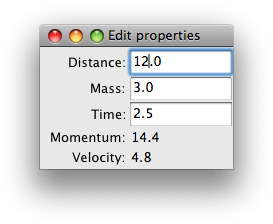

TraitslikeContextWrapper
========================

As noted, DataContexts are often put into the role of Model in a MVC UI.
However, the DataContext namespace doesn't have Traits information associated
with it, which can be an obstacle to its use in a Traits UI.  For fairly
homogeneous namespaces, or those where it is hard to know what variables
will be present, one approach is to extract and wrap the individual items in
the DataContext namespace and use them directly in the UI (often in a
TableEditor).

However, sometimes we want the DataContext itself to appear like a regular
traits object.  This approach involves listening to the events generated by
the DataContext and using them to keep local copies of the DataContext's items
synchronised with it.  This pattern is sufficiently common and useful that the
TraitslikeContextWrapper class is available to simplify this procedure.

To use the TraitslikeContextWrapper you need to use the :meth:`add_traits`
method to tell it which names in the Context should appear as traits::

    >>> from enthought.traits.api import Int
    >>> from enthought.traits.ui.api import View, Item
    >>> from enthought.traits.ui.menu import OKbutton, CancelButton
    >>> from enthought.contexts.api import DataContext, TraitslikeContextWrapper
    >>> d = DataContext(subcontext={'a': 1, 'b': 2, 'z': 20})
    >>> tcw = TraitslikeContextWrapper(_context=d)
    >>> tcw.add_traits('a', 'b', c=Int)
    >>> view = View(Item(name='a'), Item(name='b'), Item(name='c'),
    ...     buttons = [OKButton, CancelButton])
    >>> tcw.configure_traits(view=view)

.. image:: tcw_1.png

As can be seen from the window, the TraitslikeContextWrapper makes the wrapped
object act just like a regular Traits object.

Example: Simple Block Context Application
-----------------------------------------

Putting this together with the Block-Context-Execution Manager pattern, we can
easily create simple TraitsUI applications around a code block.  The following
is a simple but general application that can be found in the CodeTools
examples::

    """Simple Block Context Application
    
    This application demonstrates the use of the Block-Context-Execution Manager
    pattern, together with using a TraitslikeContextWrapper to make items inside a
    data context appear like traits so that they can be used in a TraitsUI app.
    """
    from enthought.traits.api import HasTraits, Instance, Property, Float, \
        on_trait_change, cached_property
    from enthought.traits.ui.api import View, Group, Item
    
    from enthought.contexts.api import DataContext, TraitslikeContextWrapper
    from enthought.contexts.items_modified_event import ItemsModified
    from enthought.blocks.api import Block
    
    code = """# my calculations
    velocity = distance/time
    momentum = mass*velocity
    """
    
    class SimpleBlockContextApp(HasTraits):
        # the data context we are listening to
        data = Instance(DataContext)
        
        # the block we are executing
        block = Instance(Block)
        
        # a wrapper around the data to interface with the UI
        tcw = Property(Instance(TraitslikeContextWrapper), depends_on=["block", "data"])
        
        # a view for the wrapper
        tcw_view = Property(Instance(View), depends_on="block")
        
        @on_trait_change('data.items_modified')
        def data_items_modified(self, event):
            """Execute the block if the inputs in the data change"""
            if isinstance(event, ItemsModified):
                changed = set(event.added + event.modified + event.removed) 
                inputs = changed & self.block.inputs
                if inputs:
                    self.execute(inputs)
        
        @cached_property
        def _get_tcw_view(self):
            """Getter for tcw_view: returns View of block inputs and outputs"""
            inputs = tuple(Item(name=input)
                           for input in sorted(self.block.inputs))
            outputs = tuple(Item(name=output, style="readonly")
                            for output in sorted(self.block.outputs))
            return View(Group(*(inputs+outputs)),
                        kind="live")
        
        @cached_property
        def _get_tcw(self):
            """Getter for tcw: returns traits-like wrapper for data context"""
            in_vars = dict((input, Float) for input in self.block.inputs)
            out_vars = tuple(self.block.outputs)
            tcw = TraitslikeContextWrapper(_context=self.data)
            tcw.add_traits(*out_vars, **in_vars)
            return tcw
        
        def execute(self, inputs):
            """Restrict the code block to inputs and execute"""
            # only execute if we have all inputs
            if self.block.inputs.issubset(set(self.data.keys())):
                try:
                    self.block.restrict(inputs=inputs).execute(self.data)
                except:
                    # ignore exceptions in the block
                    pass
    
    if __name__ == "__main__":
        block = Block(code)
        data = DataContext(subcontext=dict(distance=10.0, time=2.5, mass=3.0))
        execution_manager = SimpleBlockContextApp(block=block, data=data)
        execution_manager.tcw.configure_traits(view=execution_manager.tcw_view)

The interface looks like this:

Notice that the SimpleBlockContextApp has no explicit knowledge of either the
contents of the Block or the DataContext other than expecting floats for the
input variable values.  If the code variable were replaced with any other
(reasonable -- see below) code block, the code would work just as well.

